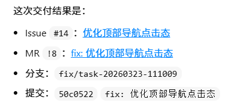
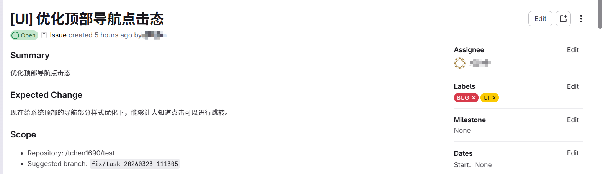
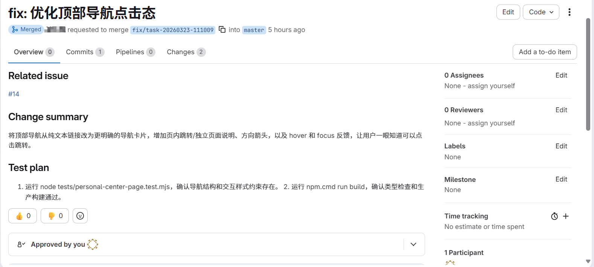
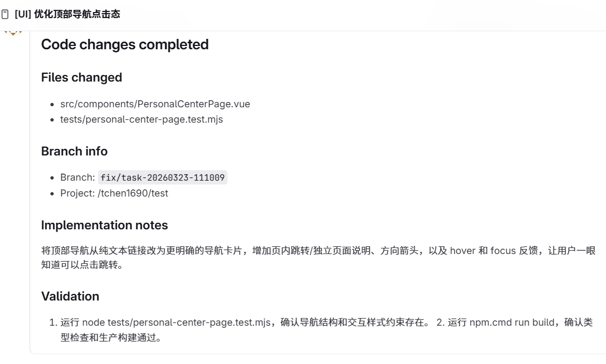
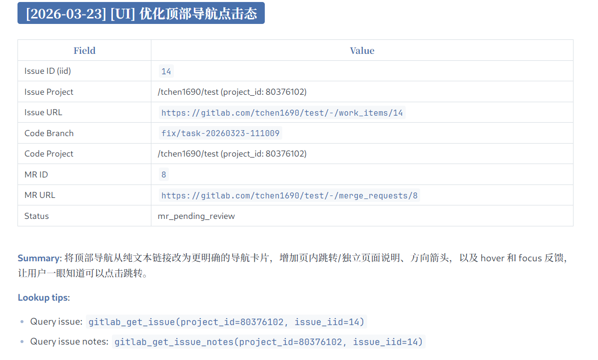

# mcp-gitlab-workflow

[English](./README.md) | [简体中文](./README.zh-CN.md)

`mcp-gitlab-workflow` 是一个面向 GitLab Issue 开发的 MCP Server。

它可以基于一段需求或一个现有 Issue，自动串起一条规范化开发链路：需求解析、创建 Issue、拉取分支、修改代码、创建 MR、回填 Issue。同时也提供一组 GitLab API 原子化工具，用于自定义编排和精细控制。

## 1. 核心能力

- `workflow_*`：将常见的需求到交付流程整合为单个工具调用
- `gitlab_*`：GitLab 原子 API 工具，适合自定义编排与精细控制

Issue 目标项目和代码交付目标项目通过 `WORKFLOW_ISSUE_PROJECT_ID` 与 `WORKFLOW_CODE_PROJECT_ID` 配置。完整配置见下方环境变量章节。

### Workflow 工具

- `workflow_requirement_to_issue`：分析需求并创建 Issue
- `workflow_review_mr_post_comment`：审查指定 MR 并发布评论
- `workflow_issue_to_delivery`：基于已有 Issue 完成分支 -> 代码修改 -> MR -> Issue 评论 -> Issue Log
- `workflow_requirement_to_delivery`：从需求开始完成完整交付流程

### GitLab 原子工具

Issue 类工具默认回落到 `WORKFLOW_ISSUE_PROJECT_ID`，代码和 MR 类工具默认回落到 `WORKFLOW_CODE_PROJECT_ID`。

- 用户与标签：`gitlab_get_current_user`、`gitlab_list_labels`、`gitlab_create_label`、`gitlab_update_label`、`gitlab_delete_label`
- Issue：`gitlab_create_issue`、`gitlab_get_issue`、`gitlab_get_issue_notes`、`gitlab_add_issue_comment`、`gitlab_get_issue_images`
- 仓库：`gitlab_create_branch`、`gitlab_get_file`、`gitlab_commit_files`、`gitlab_upload_project_file`
- MR：`gitlab_get_merge_request`、`gitlab_get_mr_notes`、`gitlab_create_merge_request`、`gitlab_create_mr_note`、`gitlab_get_mr_changes`、`gitlab_approve_mr`、`gitlab_unapprove_mr`

## 2. 使用示例

以 `workflow_requirement_to_delivery` 为例。为了让 LLM 更稳定地选择目标 workflow，建议在提示词中显式写出 tool 名称，或者封装为自定义指令 / skill。

### 输入

`使用 workflow_requirement_to_delivery 添加论坛互动功能`

### 效果

该流程可以自动完成：

`需求解析 -> 创建 Issue -> 拉取分支 -> 修改代码 -> MR -> 回填 Issue`



#### (1) Issue 创建



#### (2) 基于 issue 修改代码并提交 MR



#### (3) Issue 评论



#### (4) 本地 `issue-log.md`



通过这条流程，开发者可以将一个需求或分配给自己的 Issue 直接交给 agent，自动完成面向 Issue 的开发交付。

## 3. 配置

### 3.1 使用 NPX

```json
{
  "mcpServers": {
    "gitlab-workflow": {
      "command": "npx",
      "args": ["-y", "@chntif/mcp-gitlab-workflow"],
      "env": {
        "GITLAB_TOKEN": "YOUR_TOKEN",
        "GITLAB_API_BASE_URL": "https://gitlab.com/api/v4",
        "WORKFLOW_ISSUE_PROJECT_ID": "82346102",
        "WORKFLOW_ISSUE_PROJECT_PATH": "tchen1690/test",
        "WORKFLOW_CODE_PROJECT_ID": "82346102",
        "WORKFLOW_CODE_PROJECT_PATH": "tchen1690/test",
        "WORKFLOW_BASE_BRANCH": "develop",
        "WORKFLOW_TARGET_BRANCH": "develop",
        "WORKFLOW_LOCAL_REMOTE_NAME": "origin"
      }
    }
  }
}
```

### 3.2 Codex

#### (1) 在终端中添加

```bash
codex mcp add gitlab-workflow \
  --env GITLAB_TOKEN=YOUR_TOKEN \
  --env GITLAB_API_BASE_URL=https://gitlab.com/api/v4 \
  --env WORKFLOW_ISSUE_PROJECT_ID=80376102 \
  --env WORKFLOW_ISSUE_PROJECT_PATH=tchen1690/test \
  --env WORKFLOW_CODE_PROJECT_ID=80376102 \
  --env WORKFLOW_CODE_PROJECT_PATH=tchen1690/test \
  --env WORKFLOW_BASE_BRANCH=develop \
  --env WORKFLOW_TARGET_BRANCH=develop \
  --env WORKFLOW_LOCAL_REMOTE_NAME=origin \
  -- npx -y @chntif/mcp-gitlab-workflow
```

#### (2) 或直接写入 `config.toml`

```toml
[mcp_servers.gitlab-workflow]
command = "npx"
args = ["-y", "@chntif/mcp-gitlab-workflow"]

[mcp_servers.gitlab-workflow.env]
GITLAB_TOKEN = "YOUR_TOKEN"
GITLAB_API_BASE_URL = "https://gitlab.com/api/v4"
WORKFLOW_ISSUE_PROJECT_ID = "80376102"
WORKFLOW_ISSUE_PROJECT_PATH = "tchen1690/test"
WORKFLOW_CODE_PROJECT_ID = "80376102"
WORKFLOW_CODE_PROJECT_PATH = "tchen1690/test"
WORKFLOW_BASE_BRANCH = "develop"
WORKFLOW_TARGET_BRANCH = "develop"
WORKFLOW_LOCAL_REMOTE_NAME = "origin"
```

### 3.3 Claude Code

```bash
claude mcp add gitlab-workflow \
  -e GITLAB_TOKEN=YOUR_TOKEN \
  -e GITLAB_API_BASE_URL=https://gitlab.com/api/v4 \
  -e WORKFLOW_ISSUE_PROJECT_ID=80376102 \
  -e WORKFLOW_ISSUE_PROJECT_PATH=tchen1690/test \
  -e WORKFLOW_CODE_PROJECT_ID=80376102 \
  -e WORKFLOW_CODE_PROJECT_PATH=tchen1690/test \
  -e WORKFLOW_BASE_BRANCH=develop \
  -e WORKFLOW_TARGET_BRANCH=develop \
  -e WORKFLOW_LOCAL_REMOTE_NAME=origin \
  -- npx -y @chntif/mcp-gitlab-workflow
```

也可以直接将相同配置写入 Claude Code 的配置文件。

### 3.4 本地启动

```json
{
  "mcpServers": {
    "gitlab-workflow": {
      "command": "node",
      "args": ["/gitlab-workflow-server/dist/src/server.js"],
      "env": {
        "GITLAB_TOKEN": "YOUR_TOKEN",
        "GITLAB_API_BASE_URL": "https://gitlab.com/api/v4",
        "WORKFLOW_ISSUE_PROJECT_ID": "82346102",
        "WORKFLOW_ISSUE_PROJECT_PATH": "tchen1690/test",
        "WORKFLOW_CODE_PROJECT_ID": "82346102",
        "WORKFLOW_CODE_PROJECT_PATH": "tchen1690/test",
        "WORKFLOW_BASE_BRANCH": "develop",
        "WORKFLOW_TARGET_BRANCH": "develop",
        "WORKFLOW_LOCAL_REMOTE_NAME": "origin"
      }
    }
  }
}
```

### 3.5 关于 `uv/uvx`

本项目是 Node.js 包，推荐使用 `npx` 运行。

## 4. 环境变量

参数优先级：

`tool 参数 -> 用户配置的环境变量 -> 代码内默认值`

如果用户没有显式传入 `project_id` 等参数，tool 会回落到运行时环境变量配置；部分变量同时带有代码内默认值。

| 环境变量 | 作用 | 默认值 | 必需 |
| --- | --- | --- | --- |
| `GITLAB_TOKEN` | GitLab API 访问令牌，服务启动和所有 GitLab 操作都依赖它 | 无 | 是 |
| `GITLAB_API_BASE_URL` | GitLab API 基础地址 | `https://gitlab.com/api/v4` | 否 |
| `WORKFLOW_ISSUE_PROJECT_ID` | Issue 类工具默认使用的目标项目 ID | 无 | 否 |
| `WORKFLOW_ISSUE_PROJECT_PATH` | Issue 项目路径，用于模板渲染和引用展示 | 无 | 否 |
| `WORKFLOW_CODE_PROJECT_ID` | 仓库、分支、提交、MR 类工具默认使用的目标项目 ID | 无 | 否 |
| `WORKFLOW_CODE_PROJECT_PATH` | 代码项目路径，用于模板、日志和输出展示 | 无 | 否 |
| `WORKFLOW_BASE_BRANCH` | 创建交付分支前默认同步的基线分支 | `develop` | 否 |
| `WORKFLOW_TARGET_BRANCH` | MR 默认目标分支 | `develop` | 否 |
| `WORKFLOW_LOCAL_REMOTE_NAME` | 本地 git workflow 默认 remote 名称 | `origin` | 否 |
| `WORKFLOW_LABEL` | 默认 Issue 标题前缀与兜底标签 | 无 | 否 |
| `WORKFLOW_ASSIGNEE_USERNAME` | Issue / MR 默认指派用户名 | 无 | 否 |
| `WORKFLOW_ISSUE_LOG_PATH` | 本地 issue log 文件路径 | `issue-log.md` | 否 |
| `WORKFLOW_UPDATE_ISSUE_LOG` | delivery workflow 完成后是否默认更新本地 issue log | `true` | 否 |
| `WORKFLOW_DELIVERY_METHOD` | delivery workflow 默认执行方式，支持 `local_git` 和 `remote_api` | `local_git` | 否 |
| `WORKFLOW_CHECKOUT_LOCAL_BRANCH` | `remote_api` 交付后是否自动同步并切换到目标分支 | `false` | 否 |
| `WORKFLOW_LOCK_ISSUE_PROJECT_ID` | 锁定允许访问的 Issue 项目 ID，防止误操作其他仓库 | 无 | 否 |
| `WORKFLOW_LOCK_CODE_PROJECT_ID` | 锁定允许访问的代码项目 ID，防止误操作其他仓库 | 无 | 否 |

### 推荐配置

- `GITLAB_TOKEN`、`GITLAB_API_BASE_URL`：连接 GitLab 的必需配置
- `WORKFLOW_ISSUE_PROJECT_ID`、`WORKFLOW_CODE_PROJECT_ID`：定义 issue 项目和代码项目，可以是同一个
- `WORKFLOW_ISSUE_PROJECT_PATH`、`WORKFLOW_CODE_PROJECT_PATH`：提升引用展示效果，但不是必需
- `WORKFLOW_BASE_BRANCH`、`WORKFLOW_TARGET_BRANCH`：应与团队分支规范保持一致
- `WORKFLOW_LOCAL_REMOTE_NAME`：通常为 `origin`

如果某次操作的目标与默认环境变量不同，显式传入 tool 参数会覆盖环境变量配置。

## 5. 文档

- [工具说明](./docs/01-tool-reference.md)
- [环境变量](./docs/02-environment-variables.md)
- [Workflow 概念](./docs/03-workflow-concepts.md)
- [原子工具](./docs/04-atomic-tools.md)

## 6. License

MIT
